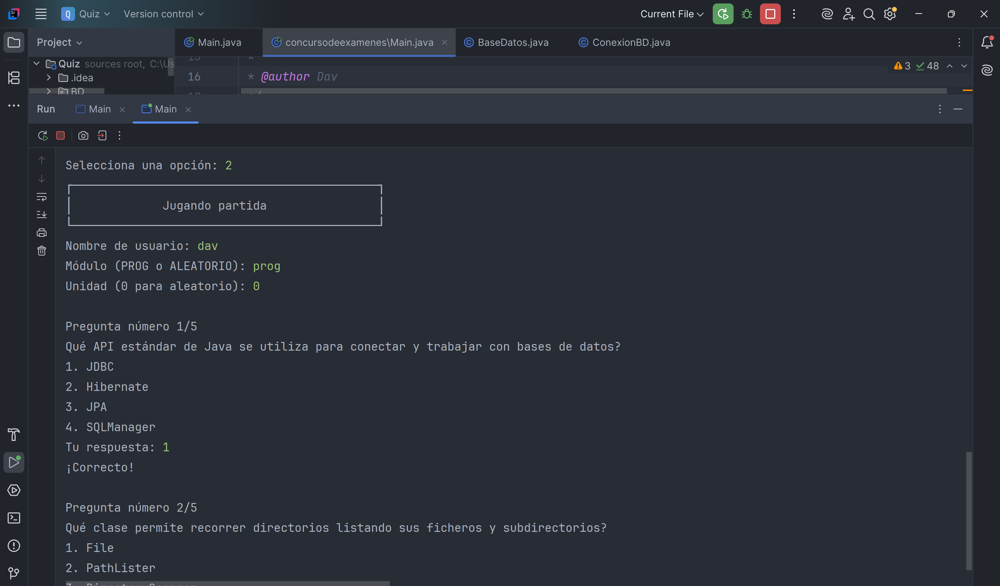

# JavaQuiz
Español
Es un concurso de preguntas donde tienes que elegir una de las opciones para ir sumando puntos, el que tenga más puntos gana
puedes ver un poco del juego en las capturas de assets

1. PRIMERO TIENES QUE TENER EL CONECTOR MYSQL CONECTADO, PUEDES DESCARGAR 
DESDE SU PÁGINA OFICIAL Y CONECTARLO CON EL MYSQL
https://dev.mysql.com/downloads/connector/j/

3. EJECUTA EL MYSQL PARA CREAR LAS TABLAS PEGA ESTO EN UN QUERY DE MYSQL
A CONTINUACIÓN:
DROP DATABASE IF EXISTS Concurso;
CREATE DATABASE Concurso CHARACTER SET utf8;
USE Concurso;
-- Tabla Pregunta
   
CREATE TABLE IF NOT EXISTS pregunta (
    id INT AUTO_INCREMENT PRIMARY KEY,
    modulo VARCHAR(50),
    unidad VARCHAR(10),
    numero VARCHAR(10),
    enunciado TEXT,
    correcta VARCHAR(255),
    incorrecta1 VARCHAR(255),
    incorrecta2 VARCHAR(255),
    incorrecta3 VARCHAR(255)
);

-- -- Tabla Puntuacion
CREATE TABLE IF NOT EXISTS usuarios (
nombre varchar(50)primary key,
puntuacion int
);
-- LUEGO SE BORRA, ES PARA VER LAS TABLAS
select * from pregunta;
select * from usuarios;

4. RECUERDA ESTAR BIEN CONECTADO CON EL BASE DE DATO PARA ELLO PUEDES
CAMBIARLO EN src > BD > ConexionBD

5. ANTES DE JUGAR TIENES QUE CARGAR LAS PREGUNTAS COMO EL FORMATO INDICADO,
EJECUTA EL MAIN Y VE A CONFIGURACIÓN DE SISTEMA DESPUÉS A CARGAR PREGUNTA,
ELIGE UN NOMBRE PARA TU MÓDULO Y ESCRIBE LA RUTA DEL ARCHIVO, TENEMOS UNA YA
CREADO CON QUE ESCRIBA preguntas_PROG.txt SE CARGARÁ, RECUERDA TENER MYSQL WORKBENCH
ABIERTO Y TAMBIEN PUEDES REFRESCAR LA TABLA PARA VER QUE SE LEYÓ CORRECTAMENTE

6. EMPIEZA A JUGAR EL JUEGO INTRODUCIENDO EL NOMBRE, DESPUÉS EL NOMBRE DEL MÓDULO
QUE TÚ INSERTASTES PRIMERO O ALEATORIO CUANDO HAY MAS MÓDULO, DESUÉS UNA UNIDAD EXISTENTE
SI NO EXISTE UNA UNIDAD O MÓDULO TENDRÁS QUE VOLVER A INTRODUCIR

_______________________________________________________________________________________________
English
It's a quiz game where you choose one of the options to accumulate points. The player with the most points wins.
You can see a bit of the game in the asset screenshots.

1. FIRST, YOU NEED TO HAVE THE MYSQL CONNECTOR CONNECTED. YOU CAN DOWNLOAD IT FROM ITS OFFICIAL WEBSITE AND CONNECT IT TO MYSQL:

https://dev.mysql.com/downloads/connector/j/

3. RUN MYSQL TO CREATE THE TABLES. PASTE THIS INTO A MYSQL QUERY BELOW:

DROP DATABASE IF EXISTS Concurso;

CREATE DATABASE Concurso CHARACTER SET utf8;

USE Concurso;

-- Question Table

CREATE TABLE IF NOT EXISTS question (
id INT AUTO_INCREMENT PRIMARY KEY,
module VARCHAR(50),
unit VARCHAR(10),
number VARCHAR(10),
statement TEXT,
correct VARCHAR(255),
incorrect1 VARCHAR(255),
incorrect2 VARCHAR(255),
incorrect3 VARCHAR(255)
);

- -- Score Table
CREATE TABLE IF NOT EXISTS users (
name varchar(50) primary key,
score int
);

- THEN IT IS DELETED, IT IS FOR VIEWING THE TABLES
select * from question;

select * from users;

4. Remember to ensure you are properly connected to the database. You can do this by changing the connection in src > BD > ConexionBD.

5. Before playing, you must load the questions in the specified format. Run the main program and go to System Configuration, then to Load Question. Choose a name for your module and enter the file path. We have one already created; simply type preguntas_PROG.txt to load it. Remember to have MySQL Workbench open, and you can also refresh the table to verify that it was read correctly.

6. Start playing the game by entering the name, then the name of the... MODULE
WHICH YOU INSERTED FIRST OR RANDOM WHEN THERE IS MORE MODULES, THEN AN EXISTING UNIT
IF A UNIT OR MODULE DOES NOT EXIST, YOU WILL HAVE TO RE-ENTER IT
7. AL TERMINAR EL JUEGO TIENES QUE DAR A CONFIGURACIÓN DEL SISTEMA Y REINICIAR JUEGO
PARA QUE CREE O MODIFIQUE LA TABLA puntuacion.txt Y SE VACIARÁ LA TABLA DE LOS JUGADORES

8. PUEDES VER EL RANKING ELIGIENDO EL 3 SI ESTÁ VACÍO NO MOSTRARÁ NADA
___________________________________________________________________________________________________
